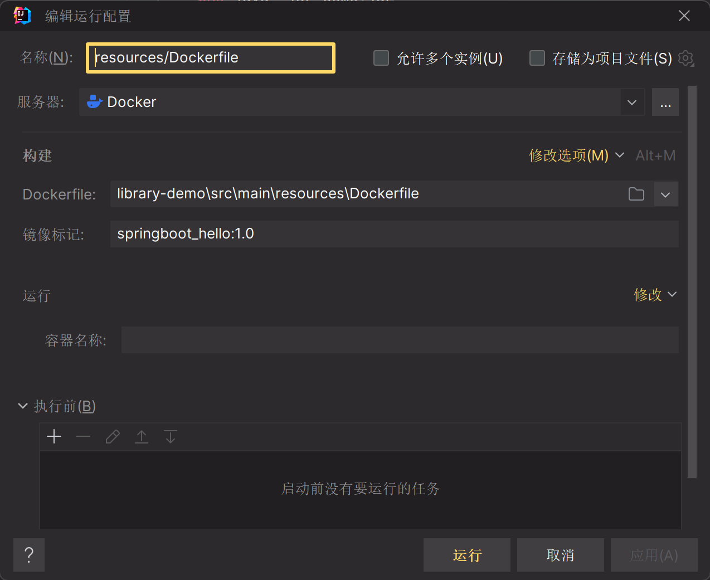

# 概念

$Dockerfile$是用来构建Docker**镜像**的文本文件，是由一条条构建镜像所需的指令和参数构成的脚本。

# Dockerfile 语法

1. 每条保留字指令都必须为大写字母，且后面要跟随至少一个参数
2. 指令按照从上到下，顺序执行
3. `#`表示注释
4. 每条指令都会创建一个新的镜像层并对镜像进行提交
5. Dockerfile的文件名只能是`Dockerfile`

## 保留字

### FROM

基础镜像，当前新镜像是基于哪个镜像的，指定一个已经存在的镜像作为模板，第一条必须是`FROM`

### EXPOSE

当前容器对外暴露的端口

### WORKDIR

指定在创建容器后，终端默认登录的工作目录

### ENV

声明在构建镜像过程中的环境变量

```dockerfile
ENV MY_PATH  /usr/mysql
```
`$`使用声明的变量

```dockerfile
WORKDIR $MY_PATH
```

### VOLUME

容器数据卷，用于数据保存和持久工作

### ADD

将主机目录下的文件拷贝进镜像且会自动处理URL和解压tar。

ADD中文件必须要和Dockerfile文件在同一位置

```
ADD jdk-8u.tar.gz /usr/local/java
```


### COPY

拷贝主机目录下的指定文件至镜像目录中

### RUN

容器构建时，需要执行的shell终端命令

```
RUN ls
```

### CMD

CMD和RUN相似。

CMD指定容器启动后(`docker run`)需要执行的命令。Dockerfile可以存在多个CMD指令，但只有最后一个生效，CMD会被`docker run` 中指定的命令替换（例如bash）

```
CMD 命令
CMD ["可执行文件","参数1","参数2",...]
```

### ENTRYPOINT

ENTRYPOINT和CMD相似，但是ENTRYPOINT不会被`docker run`覆盖

可以和CMD一起用，此时CMD后的参数将被当作ENTRYPOINT中的命令的参数传递，CMD不再提供命令

```dockerfile
FROM nginx
ENTRYPOINT nginx -c
CMD /etc/nginx/nginx.conf

#等价于以下的shell命令

nginx -c /etc/nginx/nginx.conf
```

如果docker run 存在参数，则CMD的功能将会被其参数代替

```sh
docker run nginx /etc/nginx/nginx2.conf

#等价于以下shell命令

nginx -c /etc/nginx/nginx2.conf
```

# Dockerfile build

1. docker从基础镜像运行一个容器
2. 执行一条指令并对容器做出修改
3. 执行类似于`docker commit`的操作提交至一个新的镜像层
4. docker再基于港提交的镜像运行一个新容器
5. 执行dockerfile中的下一条指令直到所有指令都执行完成

```sh
docker build -t 镜像名:TAG .
```

`.`表示Dockefile在当前路径

# 创建Springboot 项目镜像

- 根据Springboot所需要的java版本，选择基础镜像。
- 并向镜像中添加Springboot 的已经package的jar包
- 暴露容器内的端口号
- 设置启动容器后的命令：`java -jar demo.jar`

```dockerfile
FROM openjdk:17
ADD library-demo-0.0.1-SNAPSHOT.jar demo.jar
EXPOSE 80
CMD java -jar demo.jar
```

```sh
docker build -t springboot:1.0 .
docker run --name springboot1 -d -p 80:80 springboot_hello:1.0
```

IDEA中已经集成了Docker插件，我们只需要配置和Docker服务器连接即可（可使用SSH）。在IDEA中运行Dockerfile即可在Docker服务器中创建该镜像并生成一个运行容器，Docker为我们提供了Build——RUN的一站式服务

