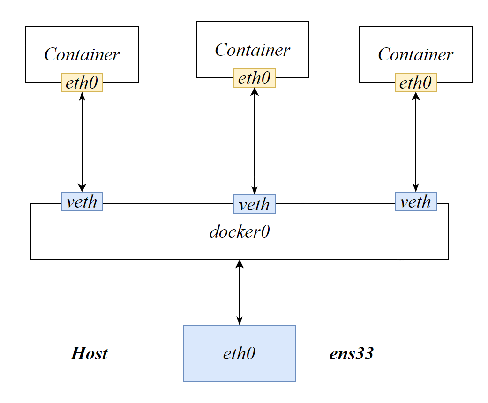
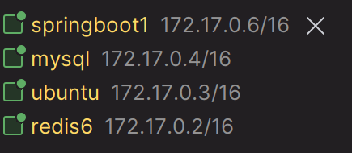
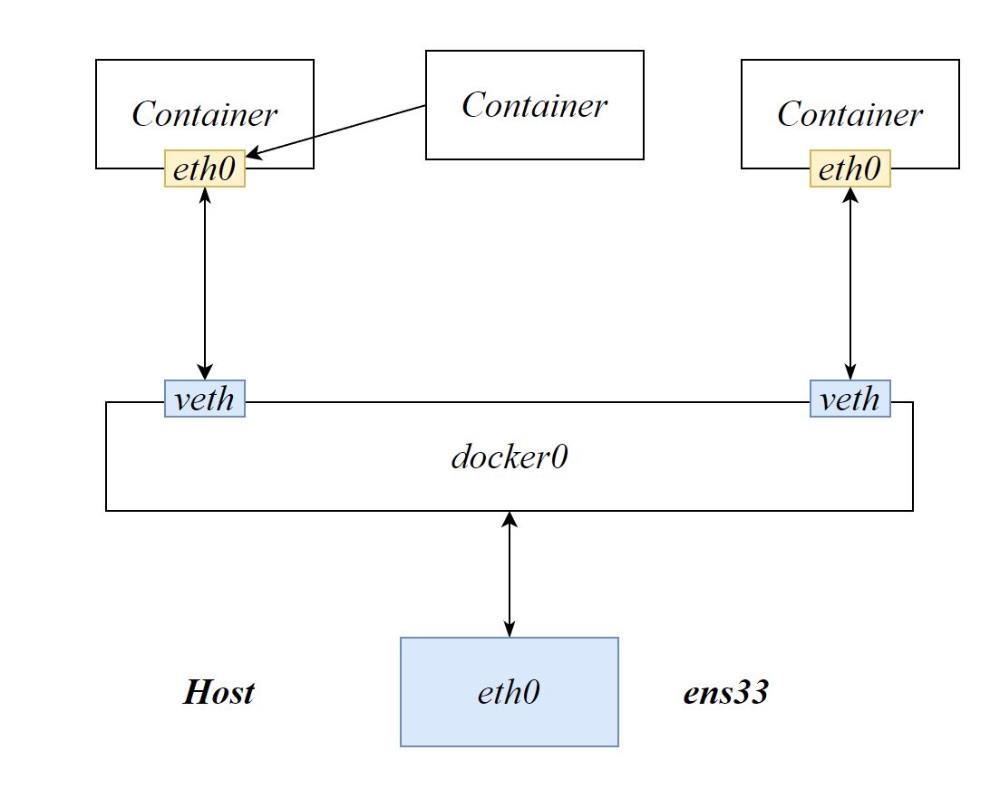

# docker 网络概述

docker 网络可以实现容器间的互联和通信以及端口映射。容器IP变动的时候可以通过服务名直接网络通信，而不受影响（类似于DNS）。

| 网络 Driver | 介绍                                                         |
| ----------- | ------------------------------------------------------------ |
| bridge      | 为每一个容器分配自己的IP，并将容器连接至一个`docker0`的网络。默认均为桥接模式 |
| host        | 容器不会虚拟自己的网卡，而是使用宿主机的IP和端口             |
| none        | 没有任何网络设置                                             |
| container   | 新创建的容器不会创建自己的网卡，而是和一个指定的容器共享IP，端口范围 |

使用`docker inspect` 容器可以查看容器的`NETWORK`

> ```json
>             "Networks": {
>                 "bridge": {
>                     "IPAMConfig": null,
>                     "Links": null,
>                     "Aliases": null,
>                     "NetworkID": "6b9312da018b8469153ceae0f41d064edee01837245ef0964f5f9129087f6efe",
>                     "EndpointID": "c1a4bb75ee768a8d31672dc8a784da7d414baa5bedff87d0244a8aa94b550738",
>                     "Gateway": "172.17.0.1",
>                     "IPAddress": "172.17.0.3",
>                     "IPPrefixLen": 16,
>                     "IPv6Gateway": "",
>                     "GlobalIPv6Address": "",
>                     "GlobalIPv6PrefixLen": 0,
>                     "MacAddress": "02:42:ac:11:00:03",
>                     "DriverOpts": null
>                 }
> 
> ```

容器重新启动会导致IPAddress发生变化

# docker network

docker network 命令

```
 docker network COMMAND
```

- create：创建一个网络
- rm：移除一个网络
- inspect：查看一个网络
- connect：连接一个容器至一个网络
- disconnect：断开连接
- ls：网络列表

```sh
docker network ls
```
将容器连接至指定容器
```
docker network connect 网络 容器
```


# bridge网络模式

Docker默认使用桥接模式，**类似于VMWare的NAT模式**，主机上将创建一个Docker网桥（docker0网卡），Docker启动一个容器时会根据网桥的网段给容器分配一个IP地址（容器IP），同时Docker网桥是每个容器的默认网关。容器和HOST就处于同一局域网中。

docker run时，没有指定network，就默认使用网桥模式。





每创建一个容器将会在host主机上创建一个新的$veth$网卡

在主机中ping各容器的ip，可以ping通，说明处于同一网络下

```sh
ping 172.17.0.3
```

# Host网络模式

容器与host主机同一IP地址，并直接使用host的端口范围，docker run不再需要指定端口映射，因为这没有意义。

```sh
docker run -d --network host --name ubuntu ubuntu
```

# container网络模式

新创建的容器不会创建自己的网卡和配置自己的IP，而是和一个指定的容器共享IP、端口范围。相当于两个容器共同组成了一个主机。

```sh
docker run --network container:容器 Alpine
```



对于Tomcat，如果都指定容器内端口为8080，则使用container网络模式会造成冲突。

# 自定义网络

自定义网络默认使用的是bridge网络模式。对于两个处于bridge网络模式的容器，可以使用IP地址相互识别，无法使用host名（服务名）识别，因为没有DNS服务器。

自定义网络可以帮助我们直接使用服务名进行通信，相当于架设了DNS服务器。

容器使用自定义网络需要我们先创建一个自定义的网络

```sh
docker network create hadoopnet
```

```sh
docker run -d 8080:8080 --network hadoopnet --name hadoop hadoop
```

