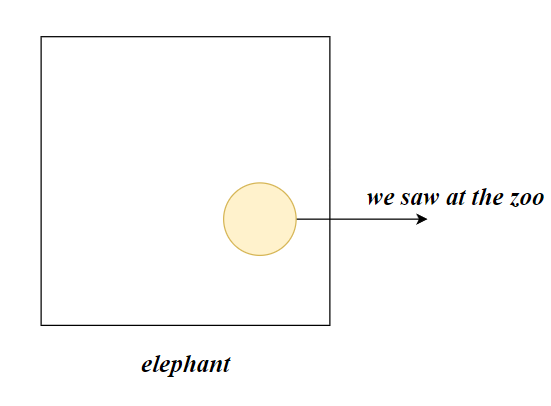
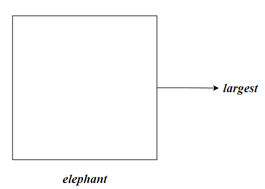

# 形容词性从句

也称为定语从句，定语从句不是句子中重要的成分，删除定语从句不影响原句子的基本的结构

先行词：形容词性从句修饰主句中的某个成分，该成分称为先行词

# 关系词

作用：

- 重复指代先行词，在从句中充当句子成分
- 起连词作用，连接两个独立主谓结构的简单句

> Sally is a teacher `who` is warm-hearted,hardworking,and quick in learning.

## 关系代词

### 主语关系代词

主语关系代词在定语从句中充当主语。

- who 某人
- which 某物
- that 人/物

在英语语法习惯使用`who`指代人，`that`指代物

> He is reading a book `that` is about human history

> A rich person is not one `who` has the most,but is one `who` needs the least

### 宾语关系代词

#### 动宾

宾语关系代词可以作为定语从句中的**动词的宾语**，可以**省略**

- who人
- whom 人，使用whom时可以让读者知道whom 必然是做动词的宾语，起提示作用
- which物
- that 人/物

> I want to have a friend `who`/`whom`/`that` I can fully trust

省略宾语关系代词

> I want to have a friend I can fully trust

traditions(that)充当从句的宾语

> There exist certain traditions in Fujian that people `that` people accustomed to Northern ways of thinking find weied

#### 介宾

介词不能单独使用，需要和名词构成介词短语。宾语关系代词可以作为定语从句中的**介词的宾语**构成介词短语

介词后置：

> The little girl `who` is a lot of  are interested `in` is Lucy

介词可以前置：

> The little girl `in` `whom` is a lot of  are interested  is Lucy

不能使用**介词+that**

## 关系副词

状态关系副词

- where 地点
- when时间
- why 原因

> This is the `town` 
>
> I grew up in this `town`

我们可以使用关系代词将两个句子合二为一：

> This is the town in which I grew up 

- `where`=`in which`

关系代词 which做介词的宾语。为了简化，我们还可以使用关系副词`where`代替`in which`

> This is the town `where` I grew up 

> compare:
>
> This is the town `where` I grew up （**Almost**）
>
> This is the town `in which` I grew up  （**Usually**）
>
> This is the town  `which` I grew up  `in` （**Seldom**）
>
> This is the town `that` I grew up `in` （**Seldom**）

> compare:
>
> This is `where` I plant  the trees （名词性从句，宾语）
>
> I plant the trees in a place `where` there is a lot of sunshine （形容词性从句，修饰place）
>
> I plant trees `where` there is a lot of sunshine （副词性从句，修饰plant）

- `when`=`on which`

> I will never forget the day `on which` I met you
>
> I will never forget the day `when` I met you

> compare:
>
> I will never forget the day that I met you
>
> I met you that day（that指代day用作副词）
>
> I met you tomorrow(时间相关的名词可以充当副词)

- `why`=`for which`

> That is the reason `for which` Sally hates her friend Mary.
>
> That is the reason `why` Sally hates her friend Mary.

## 关系限定词

whose=of which

> Sam lives in a house
>
> The roof of house is leaking

使用关系代词合并成一个句子，作为介宾

> Sam lives in a house `of which` The roof is leaking
>
> Sam lives in a house `whose` The roof is leaking

中文翻译可以直接翻译为 **的**

# 限制性与非限制性

## 理解限制性与非限制

- **限制性**：对先行词进行限制，类似于**筛选**

  

  

> One  of elephants which we saw at the zoo had only one tusk
>
> 筛选我见到的大象

- **非限制性**：对先行词不进行限制，提供额外的信息，对此进行补充说明。因为先行词**本身唯一**而不需要限制（筛选），或是**句子发起者觉得没有限制的必要**。

> **example**：
>
> An elephant,which is the earth's largest land mammal ,has few natural enemies other than human beings
>
> 描述大象的通性，句子发起者觉得没有限制的必要

> **example**：
>
> I don't wear **clothes** `which` make me different from other
>
> 我不穿那些让我看起来和别人不同的衣服。筛选：令我与众不同的某些衣服
>
> 

> I don't wear **clothes**,`which` make me different from other
>
> 我不穿衣服，因为所有的衣服都让我与众不同。clothes不进行限制，说明所有的clothes都令我感到与众不同

> **example**：
>
> The Park, where we used to play, is now a shopping center
>
> 句子发起者面前可能就是这个Park，是唯一的，不需要限制，句子接收者也能知道是哪一个Park。
>
> The Park where we used to play  is now a shopping center
>
> Author说的是曾经玩耍的公园，说明该语境可能发生在书面或Park不在面前，有必要对Park进行限制

> **example**:
>
> The food ,which wasn't in the fridge ,all went off
>
> 语境可能就发生在冰箱面前，没有必要对food进行限制
>
> The food  which wasn't in the fridge all went off
>
> 语境可能不在冰箱，作者觉得需要对food进行限制才能使听众知道说的是哪里的food

## 非限制性定语从句

非限制性定语从句中关系词和先行词之间存在逗号

先行词一般使用`which`，`who`，`where`，`when`。

以下**先行词**只能使用非限制性定语从句，而不能使用限制性定语从句

- **专有名词**，本身唯一

> Einstein,`who` was a great scientist,created the theory of relativity

- 具有**唯一性的名词**

> compare:
>
> My father,who is 50 years old,loves programming  (I have only one father)
>
> My father who is 50 years old loves programming (**False**，句意为我有多个father，其中有一位50岁的father，筛选)
>
> My father is a 50 years old people who loves programming (**True**)

- **类指名词**

> An elephant,which is the earth's largest land mammal ,has few natural enemies other than human beings

## 非限制定语从句翻译

非限制定语从句可以翻译成状语

> The food ,which wasn't in the fridge ,all went off
>
> 食物都坏了因为没有放在冰箱中