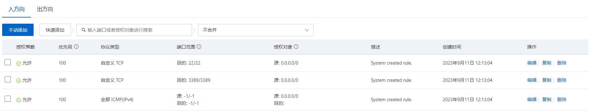

# 云服务器

## 安全组



ECS安全组设置端口开启与关闭。安装宝塔界面，宝塔也有安全组，需要同时设置两个安全组规则才会生效

## 宝塔

```bash
yum install -y wget && wget -O install.sh http://download.bt.cn/install/install_6.0.sh && sh install.sh e4dc3d315
```

