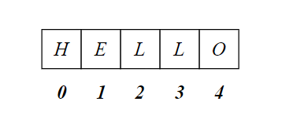
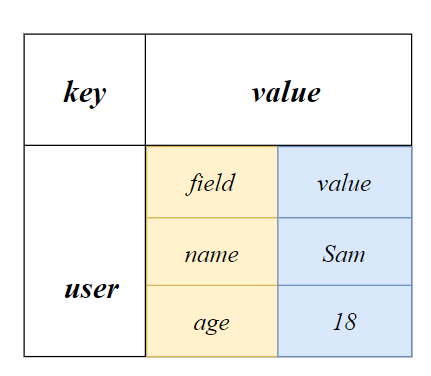
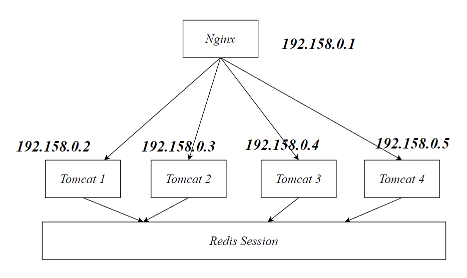
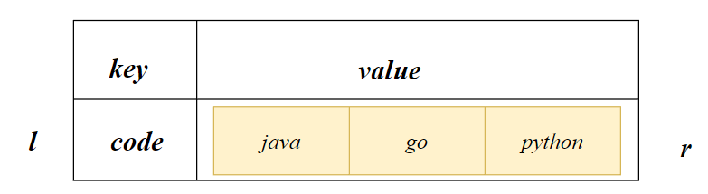

Redis中的key大部分为String类型，value则存在不同的类型，这里说的数据结构对象是value

# String

## 概念

String类似于ArrayList

## 命令

String的索引从0开始



- 添加键值对

```
set key value
```

- 将 value的内容追求到key对应的value后面，其返回值为key的value的现在长度

```
append key value
```

- 获取字符串长度

```
strlen key
```

- 当key不存在时，才能添加该键值对

```
setnx key value
```

- 设置键值对的同时设置TTL

```
setex key seconds value
```

- 覆盖key的value并返回原来的`value`

```
getset key value
```

- 将key中的数字自增/自减1

```
incr key
decr key
```

- 设置指定步长自增或自减

```
incrby key step
decrby key step
```

- 获取指定index范围的字符串

```sh
getrange key start end
```

```
set city sanmming
getrange city 0 2
# san
```

- 将指定偏移量处的字符串的一部分替换为新值

```
setrange key offset value
```

```
set city sanmming
setrange city 2 zzz
#sazzzing
```

## 原子操作

对于Redis中的命令，如果有一个失败则都失败

- 同时添加多个键值对

```
mset key1 value1 key2 value2 ...
```

- 同时获取多个value

```
mget key1 key2 ...
```

- 同时设置多个键值对，给出的key均需要不存在

```
msetnx key1 value1 key2 value2 
```


## 应用：计数器

视频播放系统使用redis记录视频播放次数。因为视频可能会存在高并发的场景，如果使用Mysql存储会导致IO占用过高，可以使用Redis存储在内存中，最后再进行数据持久化至磁盘

```
incr viewnum 
```


# Hash

## 概念

Hash类型的value是一个key:value的集合。其类似于Java中的`Map<String,Map<String,?>>`

Hash特别适合存储对象，将一个对象存储在Hash类型中比存储在String类型占用更少的内存空间

响应获取Hash中的value，需要指定`key`以及`field`



## 命令

- 将field value对存储到Hash中，键为key

```
hset key field value
```

```
hset user name Sam
hset user age 18
```

- 从key对应的hash中获取field字段的value

```sh
hget key field
#eg
hget user name
hget user age
```

- 判断是否存在field

```
hexists key field
```

- 删除key中的field字段

```
hdel key field
```

- 指定step自增/自减

```
hincrby/decrby key field step 
```

- 获取key中的所有field

```
hkeys key
```

- 获取key中所有field的value

```
hvals key 
```

- 获取key中的所有field-value对

```
hgetall key
```


## 应用：共享session

一个域名只能绑定一个IP地址，因此我们将Nginx的IP地址绑定域名，所有的请求都将进入Nginx，再由Nginx分配到各个Tomcat。不同的Tomcat存在session不共享的问题，登录状态将消失



出于负载均衡的考虑，分布式服务会将用户信息的访问均衡到不同的服务器上，用户刷新一次可能会需要重新登录，为避免这个问题，我们可以用redis将用户的session集中管理，每次获取用户更新或查询信息都直接从redis集中获取

```java
@Data
@Component
public class User {
    private String username;
    private String password;
    private Integer age;
}
```

```java
User user =new User("Sam","123456",18)
```

方式一：使用Json字符串在Redis存储【**常用**】

该方式修改需要将Json字符串转换为Java中的对象，再进行修改。转为Java对象比较容易，因此Jackson依赖可以帮助我们快速实现Json->Java 对象

```json
user_token:{
	name:Sam
	age:18
	password:123456
}
```

方式二：使用Hash类型在Redis存储

该方式修改容易，直接使用Redis命令即可修改。但是转为Java对象比较麻烦，需要处理HashMap

```
hset user_token name Sam
hset user_token age 18
hset user_token password 123456
hgetall user_token
```

```
{
    "name": "Sam",
    "age": "18",
    "password": "123456"
}
```

# List

## 概念

Redis中的List类似于双向队列，队列两段均可以元素的出入。List底层采用的是双向链表。

List是有序的，类似于Java中Map<String,List> 

List中可以存放重复的数据

## 命令

- 从右向key集合中添加value

```
rpush key value [value...]
```

- 从左开始，得到start~stop范围的value。索引支持使用-1表示最后一个，区间为左闭右闭：`[start,stop]`

```
lrange key start stop
```

- 弹出最左边的value

```
lpop key
```

- 弹出最右边的value

```
rpop key
```

- 获取列表长度

```
llen key
```

- 在 privot之前/之后插入value

```
linsert key before/after privot value
```

- 更新索引index的value

```
lset key index value
```

- 获取指定index的value

```
lindex key index
```

## 应用：favorite list

用户收藏文章列表：

```
key:user_favor_article_list
value:[aid1,aid2,aid3,...]
```

# Set

## 概念

Set集合是String类型的**无序**集合，对于Set我们可以取交集、并集、差集。类似于Java中的Map<String,Set>

Set中不能存在相同的元素

## 命令

- 向key集合中添加member元素

```sh
sadd key members[...]
#eg
sadd id 01 02 03
```

- 遍历key集合中的所有元素

```
smembers key
```

- 删除key集合中的members元素

```
srem key members[...]
```

- 从key集合中随机弹出count个元素

```
spop key count
```

- 求两个集合的差集

```
sdiff key1 key2
```

- 求两个集合的交集

```
sinter key1 key2
```

- 求两个集合的并集

```
sunion key1 key2
```

## 应用

去重

# Zset

## 概念

Zset类型也称为Sorted set类型，是一种具有排序效果的set集合，他跟set集合的区别是Zset是有序的，这是因为其每个成员都带有一个`score`以进行排序

Zset是自动实时排序的。

## 命令

- 向key集合中添加member元素，分数为score

```
zadd key score member [score member ...]
```

- 将key集合中的member元素score+ step

```
zincrby key step member
```

- 将key集合中的元素按照score升序排列，并显示[start,stop]名

```
zrange key start stop
```

- 降序排列，并显示[start,stop]名

```
zrevrange key start stop
```

- 返回member的正序/倒序名次

```
zrank/zrevrank key member
```

- 返回key集合中元素的个数

```
zcard key
```

## 应用

适用于高并发，实时的排行榜
