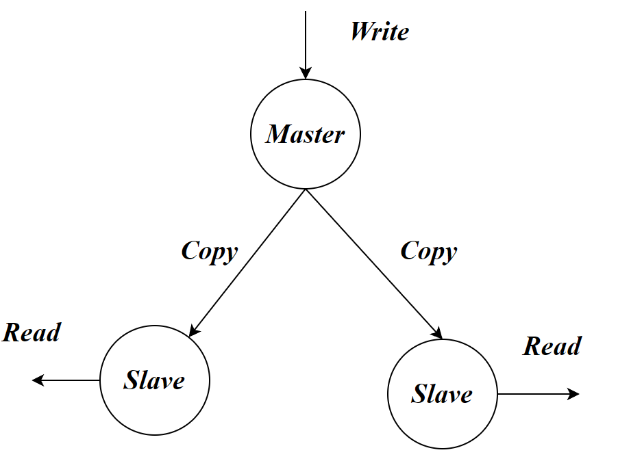

# 主从复制

主从复制，是指将一台Redis服务器的数据，复制到其他的Redis服务器。前者称为主节点(Master)，后者称为从节点(Slave)，数据的复制是单向的，只能由主节点到从节点。Master以Write为主，Slave 以Read为主。



这样的好处肯定是显而易见的：

- 实现了读写分离，提高了性能。
- 在写少读多的场景下，我们甚至可以安排很多个从节点，这样就能够大幅度的分担压力，并且就算挂掉一个，其他的也能使用。

## 主从命令

每个Redis服务要求`IP:端口`不同，即地址不同。

查看该Redis 主从信息。

```
info replication
```

- `role:master`主节点
- `role:slave`子节点。
- `connected_slaves`已连接子节点个数。
- `master_link_status`为`up`表示主从连接成功

```
#设置主节点
slaveof host ip
#设置主节点，Redis6新增
replicaof host ip
```

```
#取消slave角色
replicaof no one
```

## docker-compose

方式一：采用手动添加配置的方式设置主从关系

```yaml
version: '3'
services:
  redis-master:
    container_name: redis-master
    image: redis:latest
    # hostname: redis-master
    ports:
      - 6379:6379
    volumes:
      - /usr/data/master:/data
    command: redis-server --port 6379  
  redis-slave:
    container_name: redis-slave
    image: redis:latest
    # hostname: redis-slave
    ports:
      - 7001:6379
    volumes:
      - /usr/data/slave:/data
    command: redis-server --slaveof redis-master 6379 
```

方式二：直接修改主从的`redis.conf`

```sh
# 设置主节点的密码(当主节点设置了requirepass配置时需要配置该项)
masterauth 123456

#主节点 IP地址，使用slaveof一样的效果
replicaof redis-master 6379

```


方式三：

```yaml
version: '3'
services:
  redis-master:
    container_name: redis-master
    image: redis:latest
    # hostname: redis-master
    ports:
      - 6379:6379
    volumes:
      - /usr/data/master:/data
    command: redis-server 
  redis-slave:
    container_name: redis-slave
    image: redis:latest
    # hostname: redis-slave
    ports:
      - 7001:6379
    volumes:
      - /usr/data/slave:/data
    command: redis-server 
```
在slave节点上输入命令
```sh
replicaof redis-master 6379
```


# 哨兵模式


# 集群搭建


# 分布式锁

