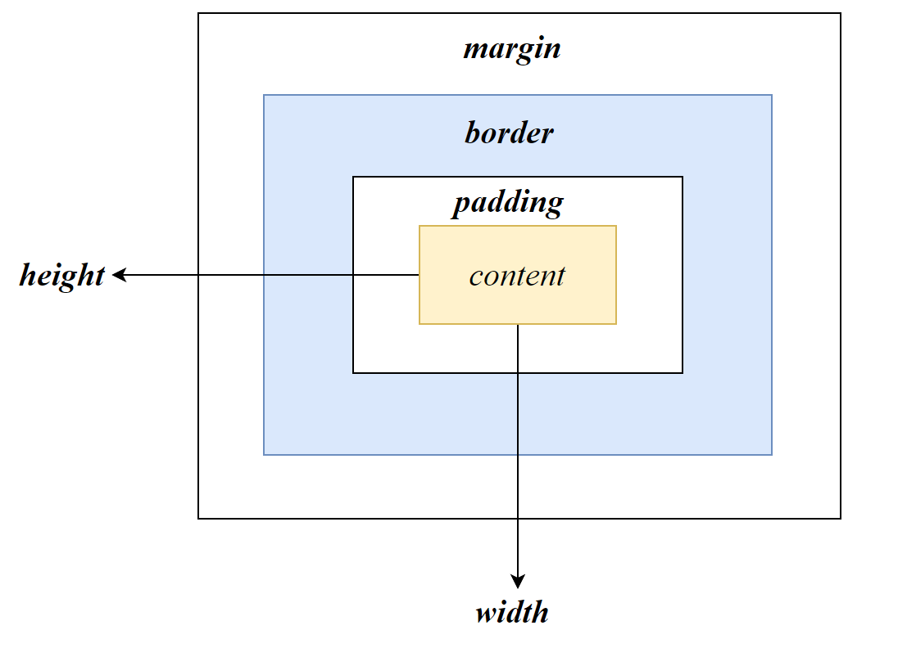

# Resource

渐变色 https://www.grabient.com/

Google font https://fonts.google.com/

Firefox浏览器发行商撰写的Web技术中文在线文档：https://developer.mozilla.org/zh-CN/docs/Web

# Box



box属性适用于所有的块级元素，对于行内元素，通过设置`dispaly:block`也可设置box属性

>box属性具有以下规则：

- 单独一个数字表示四边value

  ```css
  div{
    margin: 10px;
  }
  ```

- 两个数字表示上下、左右

  ```css
  div{
    margin: 10px 20px;
  }
  ```

  

- 四个数字表示上、下、左、右

  ```cs
  div{
    margin: 10px 20px 10px 20px;
  }
  ```

- 两个box相邻，`margin`默认取两者的最大值

# Font

- `font-family` 字体

  ```html
  font-family: 'Times New Roman', Times, serif;
  ```

> Grammer
>
> - 可以指定多个字体，字体的生效顺序从左至右，第一个字体无效将使用第二个字体。
> - 字体间使用`,`分隔
> - 如果字体名存在空格，则需要使用引号括起

- `font-size`字体 大小

  ```
  font-size: 16px;
  ```

- `font-style` 文字样式：倾斜

  ```css
  /*令斜体变正*/
  em{
    font-style: normal;
  }
  ```

- `font-weight` 字体粗细

  ```html
  font-weight: bold;
  ```

- `font`复合属性

  语法规范：不允许改变顺序

  ```
  font: font-style font-weight font-size font-family
  ```

  ```css
  font: normal bold 16px 'Times New Roman', Times, serif
  /*必须存在 size 和family，其他可以省略*/
  font: 16px 'Times New Roman', Times, serif
  ```

# list

- `list-style`

  | list-style  | style                  |
  | ----------- | ---------------------- |
  | decimal     | 数字（有序默认值）     |
  | disc        | 实心圆圈（无序默认值） |
  | none        | 无                     |
  | lower-roman | 小写罗马数字           |
  | upper-roman | 大写罗马数字           |
  | lower-alpha | 小写字母               |
  | upper-alpha | 大写字母               |

# text


适合`p`等文本元素

- `color` 文本颜色

- `text-align` 文本对齐

- `text-decoration` 文本划线

  | text-decoration | style    |
  | --------------- | -------- |
  | underline       | 下划线   |
  | line-through    | 删除线   |
  | none            | 没有划线 |

- `text-indent` 文本缩进，单位`em`（一个字）

- `line-height` 行高

# background

- `background-color` 背景颜色

- `background-image`背景图像，使用url函数指定image位置

  ```css
  background-image: url('background.jpg'); /* 设置背景图像 */
  ```

  

- `background-repeat`：背景图像重复

  | background-repeat | style                |
  | ----------------- | -------------------- |
  | repeat            | 重复（平铺，默认值） |
  | no-repeat         | 不重复               |
  | repeat-x          | 水平重复             |
  | repeat-y          | 垂直重复             |

- `background-position`背景图像位置

