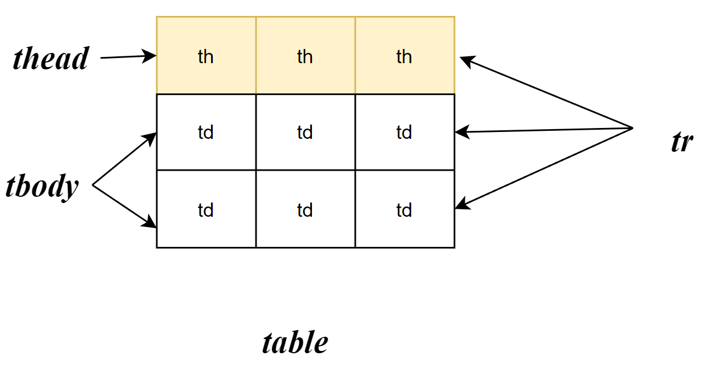

# HTML文档

## < !DOCTYPE html>

解释该页面为html文档

## < head>

head中的内容不会被浏览器渲染，可以在head中填写一些文本信息。

浏览器显示网页的标题

```
<title>this is title
```

​    

## < body>

所有在浏览器中渲染的tag都写在`<body>`中

# tag

## 块级元素

- 块级元素在页面中以块的形式展示。
- 出现在新的一行
- 占全部的宽度

### 段落 p

段落标记

> example:
>
> <p>Return random hash keys (aka fields) from the hash stored at key. If the provided count argument is positive, return a list of distinct hash keys, capped either at count or the hash size. If count is negative, the behavior changes and the command is allowed to return the same hash key multiple times. In this case, the number of returned fields is the absolute value of the specified count.</p>

### 标题 h1

标题

```html
<h4>Redis</h4>
```


> eaxmple:
>
> <h4>Redis</h4>

### 无序列表 ul

`li`(*list item*)

```html
    <ul>
        <li>Beijing</li>
        <li>Sanming</li>
        <li>Tianjing</li>
    </ul>
```

> example:
>
> <ul>
>         <li>Beijing</li>
>         <li>Sanming</li>
>         <li>Tianjing</li>
>     </ul>

### 有序列表 ol

有序列表

```html
    <ol>
        <li>Step 1</li>
        <li>Step 2</li>
        <li>Step 3</li>
    </ol>
```

> example:
>
> <ol>
>         <li>Step 1</li>
>         <li>Step 2</li>
>         <li>Step 3</li>
>     </ol>

### 表格table





- tr(table row) 行
- th(table head)表头单元格
- td(table data)表内数据单元格

```html
<table>
    <thead>
        <tr>
            <th>Key</th>
            <th>Value</th>
        </tr>
    </thead>
    <tbody>
        <tr>
            <td>name</td>
            <td>Sam</td>
        </tr>
        <tr>
            <td>Age</td>
            <td>19</td>
        </tr>
    </tbody>
</table>
```

> example:
>
> <table>
>         <thead>
>             <tr>
>                 <th>Key</th>
>                 <th>Value</th>
>             </tr>
>         </thead>
>         <tbody>
>             <tr>
>                 <td>name</td>
>                 <td>Sam</td>
>             </tr>
>             <tr>
>                 <td>Age</td>
>                 <td>19</td>
>             </tr>
>         </tbody>
>     </table>

### 表单form

表单，具体见下一节

```html
    <form>
        <div>
            <label>Name</label>
            <input type="text" name="name" placeholder="enter your name">
        </div>
    </form>
```

> example:
>
>  <form>
>      <div>
>          <label>Name</label>
>          <input type="text" name="name" placeholder="enter your name">
>      </div>
>  </form>


### 大盒子div

div用于创建一个容器，**通常用于组织和布局网页内容**。它本身没有特定的视觉效果，而是用于将其他HTML元素**分组在一起**

通过将多个tag包裹在 `<div>` 中，你可以将它们作为**一个组来处理或样式化**

```html
<div>
    <p>Return random hash keys (aka fields) from the hash stored at key. If the provided count argument is positive,return a list of distinct hash keys, capped either at count or the hash size. If count is negative, the behavior changes and the command is allowed to return the same hash key multiple times. In this case, the number of returned fields is the absolute value of the specified count.
    </p>
    <ol>
        <li>Param: must not be null. count – number of fields to return.</li>
        <li>Return: null if key does not exist or when used in pipeline / transaction.</li>
    </ol>
</div>
```

> example:
>
>     <div>
>         <p>Return random hash keys (aka fields) from the hash stored at key. If the provided count argument is positive, return a list of distinct hash keys, capped either at count or the hash size. If count is negative, the behavior changes and the command is allowed to return the same hash key multiple times. In this case, the number of returned fields is the absolute value of the specified count.
>         </p>
>         <ol>
>             <li>
>                 Param: must not be null. count – number of fields to return.
>             </li>
>             <li>Return: null if key does not exist or when used in pipeline / transaction.</li>
>         </ol>
>     </div>

## 内联元素

内联元素具有以下特点：

- 通常在块级元素内
- 不会导致文本换行
- 只占必要的部分宽度

### 链接 a

链接

- href

```html
<a href="http://www.baidu.com">click it</a>
```

>  exmple:
>
> <a href="http://www.baidu.com">click it</a>

- target

点开链接后在新窗口打开

```html
<a href="http://www.baidu.com" target="_blank">click it</a>
```


### 图像 img

```html

```

> example
>
>      style="width: 50%"    
>     alt="阴阳师永远的神" >

### 小盒子span

`<span>` 标签是HTML中的行内元素，用于在文本中应用样式或添加标记，而不会破坏文本的布局结构。**它通常用于对文本的一部分进行样式化、高亮显示或添加额外的标记**

```html
<p>这是一段普通的文本，<span style="color: red;">这是一个红色的文本。</span></p>
```

> example:
>
> <p>这是一段普通的文本，<span style="color: red;">这是一个红色的文本。</span></p>

### 换行 br

Enter

### 分割线 hr

分割线

> example:
>
> <hr>

### 缩写 abbr

解释标注的词

> <abbr title="重庆工商大学">CTBU</abbr>

## 格式元素

### strong

<strong>hello</strong>

### em

<em>hahaha</em>

# HTML实体编码

在HTML中，<tag>会被当作一个HTML标签，无论<>中的文本是什么。可以使用HTML实体编码来转义尖括号，将它们显示为普通文本。HTML实体编码是一种用来表示特殊字符和符号的方法，其中 `&lt;` 被表示为 `<`，而 `&gt;` 被表示为 `>`。

```html
<p>&lt;hahaha&gt;</p>
```

